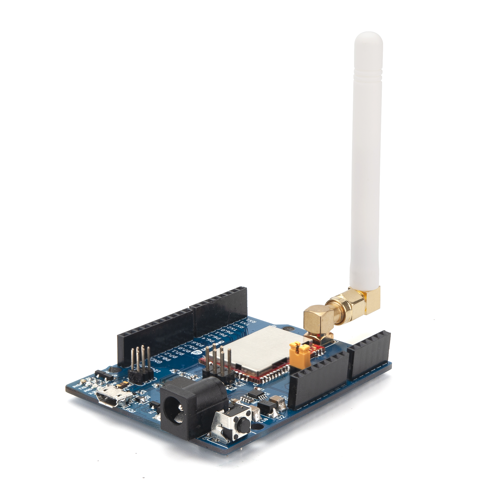

# dragino_LM502
This project provides an example for the dragino LM502 LoRaWAN module running on the demo board.

Datasheet http://www.dragino.com/downloads/index.php?dir=LM502/

# Demo board

The demo board contains an ST32F103C08TC running CMIS-DAP https://os.mbed.com/handbook/CMSIS-DAP
and the LM502 module that contains a 32-Bit RISC MCU CY8C4147AXI-S445 https://www.cypress.com/part/cy8c4147axi-s445 from Cypres and a  SX1262 https://www.semtech.com/uploads/documents/DS_SX1261-2_V1.1.pdf LoRa Modem

# Builing

The official toolchain for the cypress MCU is PSOC creator.

I was hoping that it would be possible to use platfotm io, 
https://platformio.org/
However, this might not be so easy without adding custom startup files

https://github.com/platformio/platformio-core/commit/1e21d6e05bbbeb0cc682eca9b0f1bc5e5e180b5f

~/.platformio/platforms/ststm32/builder/frameworks/cmsis.py

# Cypress MCU

The official toolchain for the cypress MCU is PSOC creator.
https://www.cypress.com/documentation/other-resources/psoc-creator-user-guide
The PSOC creator uses a modified version of cmsis  5.0  https://developer.arm.com/tools-and-software/embedded/cmsis

copy the *.c and *.h files in the Generated directory as well as the cyapicallbacks.h file to src directory
copy the file CyBootAsmGnu.s to the boot directory

# Debugging

The ST32F103 comes preflashed with cmsis-dap firmware but if you want to build your own, try this
https://github.com/devanlai/dap42 , make sure you use the correct pins to connect to the LM502 SWD pins.

ST Pin Name | Module pim  
-----| ------ 
PA_4	| SWD_CLK 
PA_2	| SWD_DATA 
PA_9	| RX1 
PA_10	| TX1

https://docs.platformio.org/en/latest/plus/debug-tools/cmsis-dap.html

